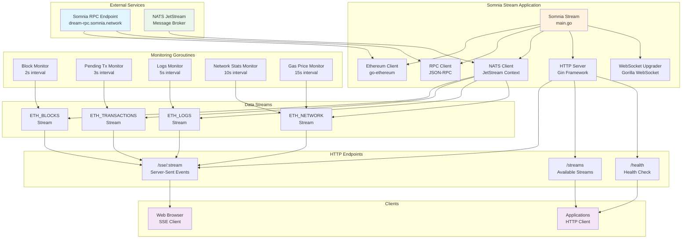

# Somnia Stream - Real-time Blockchain Data Streaming

A high-performance real-time blockchain data streaming service for the Somnia network. Somnia Stream provides live access to blockchain data including blocks, transactions, logs, and network statistics through HTTP endpoints and Server-Sent Events (SSE), powered by NATS JetStream for reliable message delivery.

## 🏗️ Architecture



## 🚀 Features

- **Real-time Blockchain Streaming**: Continuous streaming of Somnia network data
- **Multiple Data Streams**: Blocks, transactions, logs, network stats, and gas prices
- **JetStream Integration**: Persistent message streaming with NATS JetStream
- **HTTP API**: RESTful endpoints for accessing blockchain data
- **Server-Sent Events**: Real-time streaming to web clients
- **CORS Enabled**: Cross-origin resource sharing for web applications
- **Health Monitoring**: Built-in health check endpoints
- **Configurable**: Environment-based configuration

## 📊 Data Streams

| Stream Name | Subject | Description | Update Interval |
|-------------|---------|-------------|-----------------|
| `blocks` | `eth.blocks.full` | Complete block data with transactions | 2 seconds |
| `pending` | `eth.pending` | Pending transaction pool | 3 seconds |
| `logs` | `eth.logs` | Recent event logs from contracts | 5 seconds |
| `network` | `eth.network` | Network statistics and chain info | 10 seconds |
| `gasPrice` | `eth.gasPrice` | Current gas price recommendations | 15 seconds |

## 🛠️ Installation

### Prerequisites

- Go 1.24.6 or higher
- Access to Somnia RPC endpoint
- NATS server with JetStream enabled

### Build from Source

```bash
# Clone the repository
git clone <repository-url>
cd somnia-stream

# Download dependencies
go mod download

# Build the application
go build -o somnia-stream main.go
```

## ⚙️ Configuration

Configure the application using environment variables:

| Variable | Default | Description |
|----------|---------|-------------|
| `RPC_ENDPOINT` | `https://dream-rpc.somnia.network` | Ethereum RPC endpoint |
| `NATS_URL` | `nats://65.21.153.56:4222` | NATS server URL |
| `NATS_TOKEN` | `mxHF53zHj0GjiZSX` | NATS authentication token |
| `SERVER_PORT` | `8080` | HTTP server port |

### Example Configuration

```bash
export RPC_ENDPOINT="https://dream-rpc.somnia.network"
export NATS_URL="nats://your-nats-server:4222"
export NATS_TOKEN="your-nats-token"
export SERVER_PORT="8080"
```

## 🚀 Usage

### Starting the Service

```bash
# Run with default configuration
./somnia-stream

# Or run with custom environment
RPC_ENDPOINT="https://custom-rpc.example.com" ./somnia-stream
```

### API Endpoints

#### Health Check
```bash
curl http://localhost:8080/health
```

#### List Available Streams
```bash
curl http://localhost:8080/streams
```

#### Server-Sent Events (SSE)
```bash
# Stream blocks
curl http://localhost:8080/sse/blocks

# Stream pending transactions
curl http://localhost:8080/sse/pending

# Stream logs
curl http://localhost:8080/sse/logs

# Stream network stats
curl http://localhost:8080/sse/network

# Stream gas prices
curl http://localhost:8080/sse/gasPrice
```

### Web Client Example

```html
<!DOCTYPE html>
<html>
<head>
    <title>Somnia Stream</title>
</head>
<body>
    <div id="data"></div>
    
    <script>
        const eventSource = new EventSource('http://localhost:8080/sse/blocks');
        
        eventSource.onmessage = function(event) {
            const data = JSON.parse(event.data);
            document.getElementById('data').innerHTML = 
                '<pre>' + JSON.stringify(data, null, 2) + '</pre>';
        };
        
        eventSource.onerror = function(event) {
            console.error('SSE connection error:', event);
        };
    </script>
</body>
</html>
```

## 📡 Data Formats

### Block Data
```json
{
  "number": "12345",
  "hash": "0x...",
  "parentHash": "0x...",
  "timestamp": 1234567890,
  "gasUsed": 21000,
  "gasLimit": 30000000,
  "difficulty": "0",
  "size": 1024,
  "txCount": 5,
  "transactions": [...]
}
```

### Pending Transactions
```json
{
  "count": 150,
  "transactions": [...],
  "timestamp": 1234567890
}
```

### Network Statistics
```json
{
  "chainId": "0x...",
  "blockNumber": "0x...",
  "gasPrice": "0x...",
  "peerCount": "0x...",
  "syncing": false,
  "timestamp": 1234567890
}
```

## 🔧 Development

### Project Structure

```
somnia-stream/
├── main.go           # Main application file
├── go.mod           # Go module definition
├── go.sum           # Go module checksums
└── README.md        # This file
```

### Key Components

- **SomniaStream Struct**: Main application container 
- **Config**: Configuration management
- **JetStream Setup**: NATS stream configuration
- **Monitoring Goroutines**: Concurrent data collection
- **HTTP Handlers**: API endpoint implementations

### Adding New Streams

1. Add stream configuration in `setupJetStreams()`
2. Create monitoring goroutine
3. Add subject mapping in `getStreamSubject()`
4. Update documentation

## 🐳 Docker Deployment

```dockerfile
FROM golang:1.24.6-alpine AS builder
WORKDIR /app
COPY go.mod go.sum ./
RUN go mod download
COPY . .
RUN go build -o somnia-stream main.go

FROM alpine:latest
RUN apk --no-cache add ca-certificates
WORKDIR /root/
COPY --from=builder /app/somnia-stream .
EXPOSE 8080
CMD ["./somnia-stream"]
```

## 📝 Logging

The application provides comprehensive logging:
- Connection status to RPC and NATS
- Stream setup and configuration
- Data processing statistics
- Error handling and recovery

## 🛡️ Security Considerations

- **CORS**: Currently configured for development (allow all origins)
- **Authentication**: NATS token-based authentication
- **Rate Limiting**: Consider implementing for production use
- **Input Validation**: RPC responses are validated

## 🤝 Contributing

1. Fork the repository
2. Create a feature branch
3. Make your changes
4. Add tests if applicable
5. Submit a pull request

## 📄 License

This project is licensed under the MIT License - see the LICENSE file for details.

## 🔗 Dependencies

- **[go-ethereum](https://github.com/ethereum/go-ethereum)**: Ethereum client library
- **[gin-gonic](https://github.com/gin-gonic/gin)**: HTTP web framework
- **[nats.go](https://github.com/nats-io/nats.go)**: NATS messaging client
- **[gorilla/websocket](https://github.com/gorilla/websocket)**: WebSocket implementation
- **[rs/cors](https://github.com/rs/cors)**: CORS middleware

## 🐛 Troubleshooting

### Common Issues

1. **Connection Refused**: Check RPC endpoint availability
2. **NATS Connection Failed**: Verify NATS server and credentials
3. **No Data Streaming**: Check network connectivity and permissions
4. **High Memory Usage**: Adjust stream retention policies

### Debug Mode

Enable verbose logging by setting:
```bash
export GIN_MODE=debug
```

## 📞 Support

For support and questions:
- Create an issue in the repository
- Check the troubleshooting section
- Review the logs for error details
